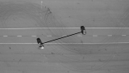
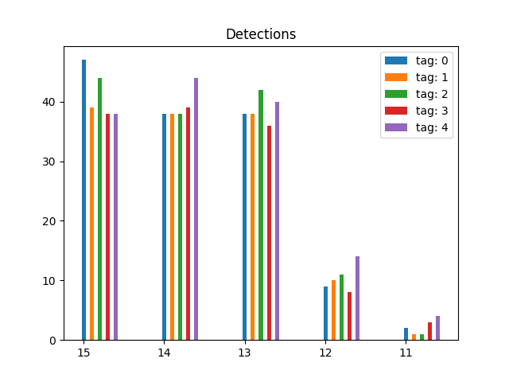
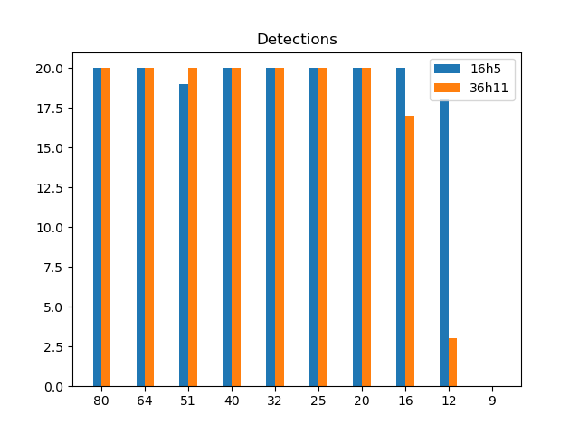
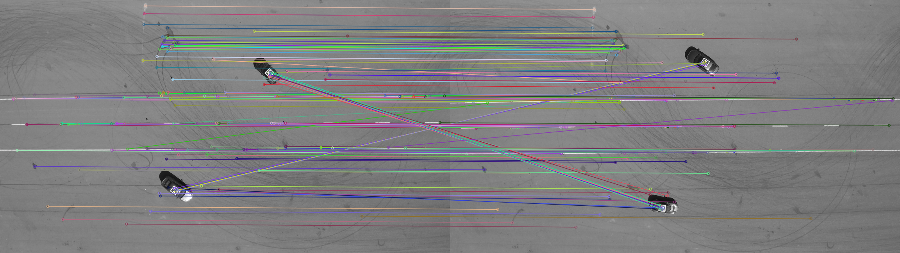

# TRI Drone Project, NAVLab

*Author: Torstein Ørbeck Eliassen*

## Introduction

The software in this repository processes drone images/ web cam images in order to obtain relative distance measurements.
Multiple approaches for detection have been investigated, such as apriltag detection, feature detection and color segmentation.

## Tracking videos

The following videos are tracked using 1 apriltag detection and then SIFT detection to generate the relative vector visualized below. 

*Flightroom tracking*

*Thunderhill tracking*

## Apriltag tag comparisons

*Tag family 16h5: Id comparison*

*Tag families at low resolution*

## SIFT detections

SIFT detect and match on arbitrary image: 

